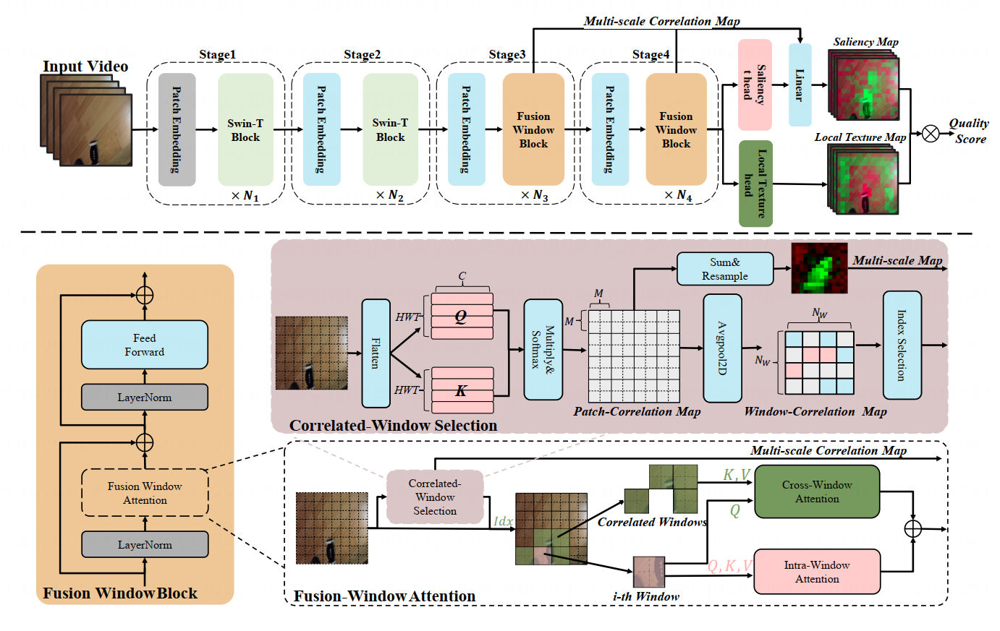

# KVQ: Boosting Video Quality Assessment via Saliency-guided Local Perceptio
<div align="center">

[](https://arxiv.org/abs/2503.10259)&nbsp;
[](https://huggingface.co/lero233/KVQ)&nbsp;
[](https://huggingface.co/datasets/lero233/LPVQ)&nbsp;


Yunpeng Qu<sup>1,2</sup> | Kun Yuan<sup>2</sup> | Qizhi Xie<sup>1,2</sup> | Ming Sun<sup>2</sup> | Chao Zhou<sup>2</sup> | Jian Wang <sup>1</sup> 

<sup>1</sup>Tsinghua University, <sup>2</sup>Kuaishou Technology.
</div>

## 🚀 Overview framework

Video Quality Assessment (VQA), which intends to predict the perceptual quality of videos, has attracted increasing attention. Due to factors like motion blur or specific distortions, the quality of different regions in a video varies. Recognizing the region-wise local quality within a video is beneficial for assessing global quality and can guide us in adopting fine-grained enhancement or transcoding strategies. Due to the heavy cost of annotating regionwise quality, the lack of ground truth constraints from relevant datasets further complicates the utilization of local perception. Inspired by the Human Visual System (HVS) that links global quality to the local texture of different regions and their visual saliency, we propose a Kaleidoscope Video Quality Assessment (KVQ) framework, which aims to effectively assess both saliency and local texture, thereby facilitating the assessment of global quality. Our framework extracts visual saliency and allocates attention using Fusion-Window Attention (FWA) while incorporating a Local Perception Constraint (LPC) to mitigate the reliance of regional texture perception on neighboring areas. KVQ obtains significant improvements across multiple scenarios on five VQA benchmarks compared to SOTA methods. Furthermore, to assess local perception, we establish a new Local Perception Visual Quality (LPVQ) dataset with region-wise annotations. Experimental results demonstrate the capability of KVQ in perceiving local distortions.


## 🔥Installation
```
## git clone this repository
git clone https://github.com/lero233/KVQ.git
cd KVQ

# create an environment with python >= 3.9
conda create -n kvq python=3.9
conda activate kvq
pip install -r requirements.txt
```

## 🔥LPVQ dataset
To validate the assessment of local perception, we present the first dataset encompassing local quality annotations, named as Local Perception Visual Quality (LPVQ) dataset. LPVQ comprises a total of 50 images meticulously collected from a typical short-form video platform, showcasing a wide range of scenes and quality factors to ensure representativeness. 

We evenly divide each image into non-overlapping 7×7 grids. We assign a subjective quality rating ranging from 1
to 5 points (interval of 0.5) to each patch, involving 14 expert visual researchers for annotation.
The LPVQ images are saved in `LPVQ/` and their label is saved in `labels/LPVQ.txt`. You can also get it from <a href='https://huggingface.co/datasets/lero233/LPVQ'></a>. 

## 🔥Inference
#### Step 1: Prepare testing datasets
- Download Corresponding Datasets.
LSVQ: [Github](https://github.com/baidut/PatchVQ)
KoNViD-1k: [Official Site](http://database.mmsp-kn.de/konvid-1k-database.html)
LIVE-VQC: [Official Site](http://live.ece.utexas.edu/research/LIVEVQC/)
- Change dataset paths and label paths in `configs/test.yaml`.
- Our pretrained weights should be placed in `weights/KVQ.pth` , which you can get from <a href='https://huggingface.co/lero233/KVQ'></a>.

#### Step 2: Run code
```
python test.py --config configs/test.yaml
```

## 🔥 Train 

#### Step1: Prepare training and testing datasets
- Download Corresponding Datasets.
LSVQ: [Github](https://github.com/baidut/PatchVQ)
KoNViD-1k: [Official Site](http://database.mmsp-kn.de/konvid-1k-database.html)
LIVE-VQC: [Official Site](http://live.ece.utexas.edu/research/LIVEVQC/)
- Change training and testing dataset paths and label paths in `configs/kvq.yaml`.
- Our pretrained weights should be placed in `weights/KVQ.pth` , which you can get from <a href='https://huggingface.co/lero233/KVQ'></a>.

#### Step2: Prepare pretrained weights
- You can use the original [Swin-T Weights](https://github.com/SwinTransformer/storage/releases/download/v1.0.4/swin_tiny_patch244_window877_kinetics400_1k.pth) to initialize the model. Or we suggest you pretrain our KVQ on [Kinetics-400](https://github.com/cvdfoundation/kinetics-dataset) dataset for better results. The pretrained weights should be put into `pretrained_weight/`

#### Step2: Run code
```
CUDA_VISIBLE_DEVICES=0,1,2,3,4,5,6,7 python -m torch.distributed.launch --nproc_per_node=8 --use_env train.py --config configs/kvq.yaml
```
You can modify the parameters in `configs/kvq.yaml` to adapt to your specific need, such as the `batch_size` and the `learning_rate`.


## Citations
If our work is useful for your research, please consider citing and give us a star ⭐:
```
@article{qu2025kvq,
  title={KVQ: Boosting Video Quality Assessment via Saliency-guided Local Perception},
  author={Qu, Yunpeng and Yuan, Kun and Xie, Qizhi and Sun, Ming and Zhou, Chao and Jian, Wang},
  journal={arXiv preprint arXiv:2503.10259},
  year={2025}
}
```

## Contact
Please feel free to contact: `qyp21@mails.tsinghua.edu.cn`. 
I am very pleased to communicate with you.

## Acknowledgments
This project is based on [FAST-VQA](https://github.com/VQAssessment/FAST-VQA-and-FasterVQA) and some codes are brought from [BiFormer](https://github.com/rayleizhu/BiFormer). Thanks for their excellent works.
